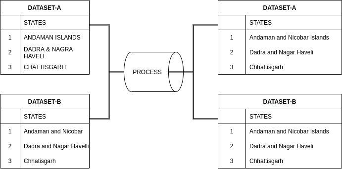

### Introduction 
While working with multiple dataset , sometimes conflict are generated during Naming convention.
The key to resolve such conflicts is to apply ***STANDARDISATION***

**IN A NUTSHELL** : 
> It is a script used to replace improper names for *STATES* & *CONSTITUENCIES* and replace it with Standard Names and saves us trouble for manully writing cleaning script for Most of the part.

### Basic Idea

If  `DATASET-A` and `DATASET-B` is to be mapped on states before Standardisation there will be conflict:

1) States names may be different
2) Capitalization issue; title format or upper format etc.
3) '&' or 'and'

### Why need this ?
- Consistency throughout multiple projects
    
    - While using datasets from multiple data source , it is not necessary that a common naming convention is used.

- Resolves Headache for validating correct terms for Geospatial Dataset , while cleaning every time.
    
- Saves a lot of time and effort, while cleaning each dataset and obsoleting error in names.

### resources
- [Record Linking Libraries](https://pbpython.com/record-linking.html)